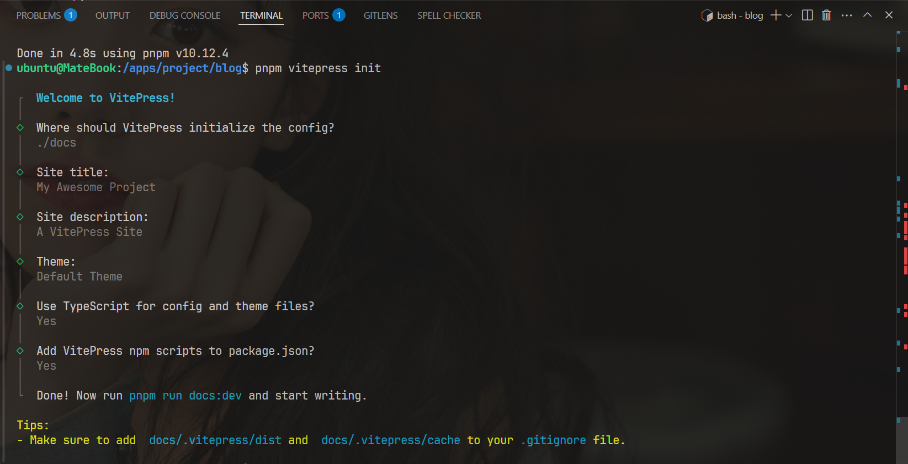
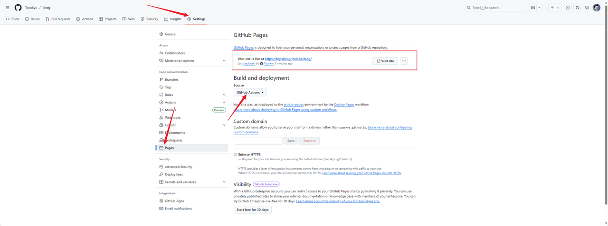
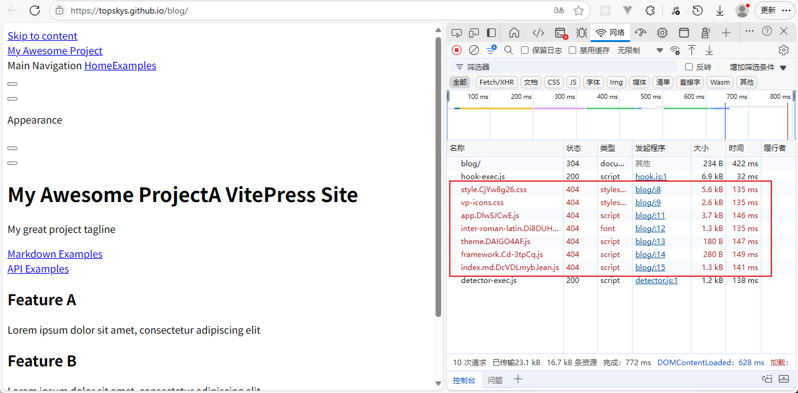
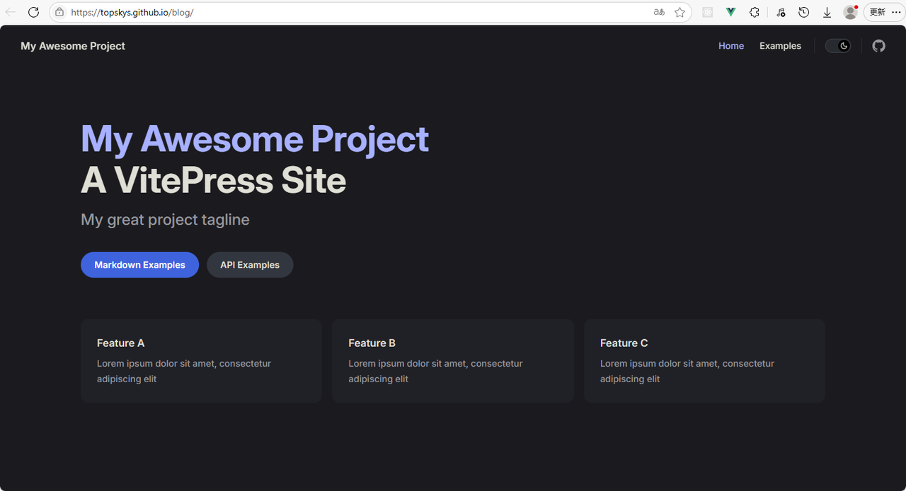
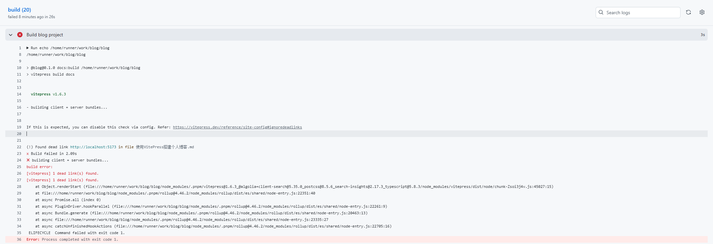

# 使用 VitePress 搭建个人博客

## 前言

本文介绍了如何使用 VitePress 搭建个人博客，并部署到 Github Pages。

## VitePress 是什么？

VitePress 是一个基于 Vite 的静态网站生成器（SSG），它可以快速搭建个人博客或者文档网站。VitePress 具有以下特点：

- 基于 Vite，具有快速的热更新和构建速度
- 支持 Markdown 语法，可以方便地编写文档和博客
- 支持 Vue 组件，可以自定义页面布局和样式
- 支持国际化，可以轻松地支持多语言
- 支持自定义主题，可以自定义页面样式和布局

## 如何使用 VitePress 搭建个人博客？

创建一个新的文件夹，作为博客项目的根目录，并进入该目录。使用 npm 或 pnpm 初始化一个 package.json 包管理配置文件。安装 VitePress，并使用其命令行工具初始化项目。最后运行开发服务器即可看到博客页面。

### 1. 新建目录

新建一个文件夹，并进入

```bash
mkdir blog
cd ./blog
```

### 2. 初始化 package.json

使用 npm（或 pnpm）初始化一个 package.json 包管理配置文件，本文使用 pnpm 作为示例。

```bash
npm init -y
# 或者
pnpm init -y
```

### 3. 安装 VitePress

将 VitePress 下载安装到项目开发依赖中。在项目根目录下执行以下命令：

```bash
pnpm add -D vitepress
```

### 4. 初始化 VitePress 项目

使用 VitePress 提供的命令行工具初始化项目。在项目根目录下执行以下命令：

```bash
pnpm vitepress init
```

选择一个生成项目目录（./docs），其他配置默认即可，后续可以修改。



### 5. 运行

启动 VitePress 开发服务器。在项目根目录下执行以下命令：

```bash
pnpm run docs:dev
```

使用浏览器访问 http://localhost:5173，即可看到博客页面。

## 部署 Github Pages

### 1. 创建仓库

在 Github 上创建一个仓库，用于存放博客源码和静态文件。

创建 github 仓库，这里不做详细赘述，大家可以参考[官方文档](https://docs.github.com/zh/repositories/creating-and-managing-repositories/quickstart-for-repositories){target="\_blank"}或者网上教程。

### 2. 启用 Github Pages

在新建仓库的设置中，找到 Github Pages 选项，选择源分支为 main，并启用 Github Actions。



### 3. 配置 Github Actions

在仓库根目录下创建.github/workflows/deploy.yml，用于配置 Github Actions。

```yaml
name: Deploy Pages

# 触发条件，push到main分支或者pull request到main分支
on:
  push:
    branches: [main]
  pull_request:
    branches: [main]

  # 支持手动在工作流上触发
  workflow_dispatch:

# 设置时区
env:
  TZ: Asia/Shanghai

# 权限设置
permissions:
  # 允许读取仓库内容的权限。
  contents: read
  # 允许写入 GitHub Pages 的权限。
  pages: write
  # 允许写入 id-token 的权限。
  id-token: write

# 并发控制配置
concurrency:
  group: pages
  cancel-in-progress: false

# 定义执行任务
jobs:
  # 构建任务
  build:
    runs-on: ubuntu-latest

    # node v20 运行
    strategy:
      matrix:
        node-version: [20]

    steps:
      # 拉取代码
      - name: Checkout
        uses: actions/checkout@v3
        with:
          # 保留 Git 信息
          fetch-depth: 0

      # 设置使用 Node.js 版本
      - name: Use Node.js ${{ matrix.node-version }}
        uses: actions/setup-node@v3
        with:
          node-version: ${{ matrix.node-version }}

      # 使用 最新的 PNPM
      # 你也可以指定为具体的版本
      - uses: pnpm/action-setup@v2
        name: Install pnpm
        with:
          version: latest
          # version: 9
          run_install: false

        # 安装依赖
      - name: Install dependencies
        run: pnpm install --frozen-lockfile

        # 构建项目
      - name: Build blog project
        run: |
          echo ${{ github.workspace }}
          pnpm docs:build

        # 资源拷贝
      - name: Build with Jekyll
        uses: actions/jekyll-build-pages@v1
        with:
          source: ./docs/.vitepress/dist
          destination: ./_site

        # 上传 _site 的资源，用于后续部署
      - name: Upload artifact
        uses: actions/upload-pages-artifact@v3

  # 部署任务
  deploy:
    environment:
      name: github-pages
      url: ${{ steps.deployment.outputs.page_url }}
    runs-on: ubuntu-latest
    needs: build
    steps:
      - name: Deploy to GitHub Pages
        id: deployment
        uses: actions/deploy-pages@v4
```

该配置参考自[是柠新呀的知识库](https://xuxing409.github.io/my-blog/technology/article/building-blog-with-vitepress.html#%E9%83%A8%E7%BD%B2github-pages){target="\_blank"}，略有改动。

### 4. 提交代码

将博客源码提交到 Github 仓库中，并等待 Github Actions 自动构建和部署。

```bash
git add .
git commit -m "first commit"
git remote add origin https://github.com/<your-github-username>/<your-repo-name>.git
git branch -M main
git push origin main
```

### 5. 解决问题

问题1：访问 Github Pages 时，发现网页加载不出来。

访问 https://&lt;your-github-username&gt;.github.io/&lt;your-repo-name&gt;，发现网页没有加载到资源，几乎所有的请求都显示 404。



原因：当前 VitePress 默认的 base 路径是斜杠（/，当前域名，不携带其他路径），访问文档的地址包含了仓库名，导致资源加载出错。

解决：解决方法是在配置文件中添加 base 配置项，base 项的值为你创建仓库的仓库名。

```js
// .vitepress/config.mts
export default {
  base: "/<your-repo-name>/", // 此处填写你的仓库名，例如：'/blog/'
  // ...
};
```

再访问 https://&lt;your-github-username&gt;.github.io/&lt;your-repo-name&gt;，可以发现网页已经可以正常加载了。



问题2：文章存在伪链接时，打包会报错。



原因：VitePress 在打包时会检查链接，如果存在死链接则会报错。

解决：在配置文件中添加 ignoreDeadLinks: true，忽略死链接。

```js
// .vitepress/config.mts
export default {
  ignoreDeadLinks: true,
  // ...
};
```

这样，你的个人博客就部署到 Github Pages 上了。后续只需要将编写好的博客源码提交到 Github 仓库中，就可以自动构建和部署了。

VitePress 其他配置项可以参考[官方文档](https://vitepress.dev/zh/)。
